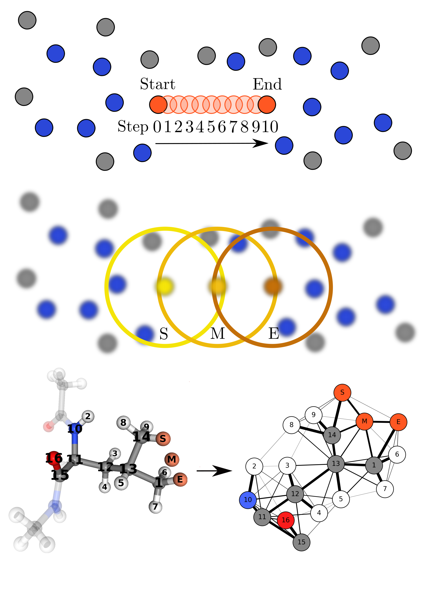

## Code repository for
# [Predicting hydrogen atom transfer energy barriers using Gaussian process regression]()

Evgeni Ulanov[^1], Ghulam A. Qadir[^1], Kai Riedmiller[^1], Pascal Friederich[^2][^3], Frauke Gräter[^1][^4]

[^1]: [Heidelberg Institute for Theoretical Studies](https://www.h-its.org/), Heidelberg, Germany
[^2]: [Institute of Theoretical Informatics, Karlsruhe Institute of Technology](https://www.iti.kit.edu/en/start), Karlsruhe, Germany
[^3]: [Institute of Nanotechnology, Karlsruhe Institute of Technology](https://www.int.kit.edu/), Eggenstein-Leopoldshafen, Germany
[^4]: [Interdisciplinary Center for Scientific Computing](https://typo.iwr.uni-heidelberg.de/home), Heidelberg, Germany

---
This repository is a collection of python scripts used in the paper
[Predicting hydrogen atom transfer energy barriers using Gaussian process regression]()

### Abstract
Predicting reaction barriers for arbitrary configurations based on only a limited set of density functional theory (DFT) calculations would render the design of catalysts or the simulation of reactions within complex materials highly efficient. We here propose Gaussian process regression (GPR) as a method of choice if DFT calculations are limited to hundreds or thousands of barrier calculations. For the case of hydrogen atom transfer in proteins, an important reaction in chemistry and biology, we obtain a mean absolute error of 3.23 kcal/mol for the range of barriers in the data set using SOAP descriptors and similar values using the marginalized graph kernel. Thus, the two GPR models can robustly estimate reaction barriers within the large chemical and conformational space of proteins. Their predictive power is comparable to a graph neural network-based model, and GPR even outcompetes the latter in the low data regime. We propose GPR as a valuable tool for an approximate but data-efficient model of chemical reactivity in a complex and highly variable environment.



*Top to bottom: <br>
(A) Hydrogen Atom Transfer (HAT) reaction modelled with hydrogen atom moving start to end in equidistant
steps.<br>
(B) Environments used to capture the local environments using SOAP vectors.<br>
(C) Illustration of a molecular HAT reaction captured as a graph.*

### How to reproduce the results of the paper

> [!NOTE]
> This guide assumes a cluster type environment with SLURM & MPI installed and might
> not work on a local computer.

1. Clone the repository.
1. Download the structures from [heidata of Heidelberg University](https://doi.org/10.11588/data/TGDD4Y)
   and place them, as well as the [metadata.csv](data/pdb/metadata.csv) into [data/pdb](data/pdb) as described in [pdb_to_atoms.py](data%2Fpdb_to_atoms.py).
   Afterward the structures need to be unzipped:
   ```bash
   $ unzip dataset_traj.zip && mv dataset_2208_traj traj
   $ unzip dataset_synth.zip && mv dataset_2208_synth synth
   ```
1. Create [local.env](local.env) in the project root file with variables:
   - PROJECTROOT (absolute path to the root of the project)
   - CONDABIN (absolute path to the conda executable, e.g. CONDABIN="/.../miniconda3/bin/conda")
   - OPENMPIMODULE - The OpenMPI module to be loaded in the HPC environment, e.g. "OpenMPI/3.1.4-GCC-8.3.0"
1. Install the conda environments _main_gpr_env_, _mgk_gpr_env_ and _painn_env_
    by executing [install.sh](install%2Finstall.sh) inside the [install](install) folder (make executable first with chmod).
1. Extract the ASE atom structures from the pdb files by running [pdb_to_atoms.py](data%2Fpdb_to_atoms.py) (Environment: main_gpr_env).
1. Run [atoms_to_soap.py](data%2Fatoms_to_soap.py) (Environment: main_gpr_env) with ```config = dict(i_position=x, [...])``` for x=0, 5 and 10 once each and note the
    corresponding SD-*.npy name.
1. Insert the correct SOAP distance files from the last step into [MAIN_RUN.py](SOAP_GPR%2FMAIN_RUN.py)
    & [SOAP_second_stage.py](two_stage_learning_PaiNN_SOAP%2FSOAP_second_stage.py) by editing the ```config=(soaps={"s_0.0": x, "s_5.0": y, "s_10.0": z, [...])``` dictionary.
1. Run [submit_SOAP_GPR.sh](SOAP_GPR%2Fsubmit_SOAP_GPR.sh) with ```sbatch``` which does all the SOAP GPR calculations.
1. Train the PaiNN models using [submit_data_efficiency.sh](PaiNN%2Fbarrier_gnn%2Fusage%2Fsubmit_data_efficiency.sh)
    with ````sbatch````
1. Run [analyse_GPR_and_PaiNN_results.py](analyse_and_plot%2Fanalyse_GPR_and_PaiNN_results.py) (Environment: main_gpr_env) to collect
    the results of PaiNN and SOAP.
1. Train PaiNN models for the two stage learning with [submit_two_stage_learning.sh](PaiNN%2Fbarrier_gnn%2Fusage%2Fsubmit_two_stage_learning.sh)
1. Collect the PaiNN two stage learning predictions with [submit_collect_painn_predictions.sh](two_stage_learning_PaiNN_SOAP%2Fsubmit_collect_painn_predictions.sh)
1. Train SOAP model on difference of PaiNN predictions with [submit_SOAP_second_stage.sh](two_stage_learning_PaiNN_SOAP%2Fsubmit_SOAP_second_stage.sh)
1. Create the MGK covariance matrix with [submit_calculate_K.sh](MGK_GPR%2Fsubmit_calculate_K.sh)
1. Find optimal parameters of MGK with [optimize_kernel_parameters.py](MGK_GPR%2Foptimize_kernel_parameters.py) (Environment: mgk_gpr_env)
1. Figure of prediction comparison of SOAP GPR, MGK GPR and PaiNN: [traj_predictions.py](analyse_and_plot%2Ftraj_predictions.py) (Environment: main_gpr_env)
1. Figure of the data efficiency: [data_efficiency_SOAP_PaiNN.py](analyse_and_plot%2Fdata_efficiency_SOAP_PaiNN.py) (Environment: main_gpr_env)
1. Figure of coverage and negative interval score: [plot_interval_score.py](analyse_and_plot%2Fplot_interval_score.py) (Environment: main_gpr_env)
1. Figure of two stage learning MAE of SOAP GPR with PaiNN: [plot_two_stage_predictions.py](analyse_and_plot%2Fplot_two_stage_predictions.py) (Environment: main_gpr_env)

### Hardware and Software used:
- CPU: Intel(R) Xeon(R) Gold 6230
- GPU: NVIDIA GeForce RTX 2080 SUPER
- Conda version: 22.11.1
- OpenMPI: 3.1.4
- The individual packages used, including version numbers, can be found in the folders of [install](install).

### Atomic structures and data
The structures and energies used in this project can be downloaded from [heiDATA of Heidelberg University](https://doi.org/10.11588/data/TGDD4Y).
